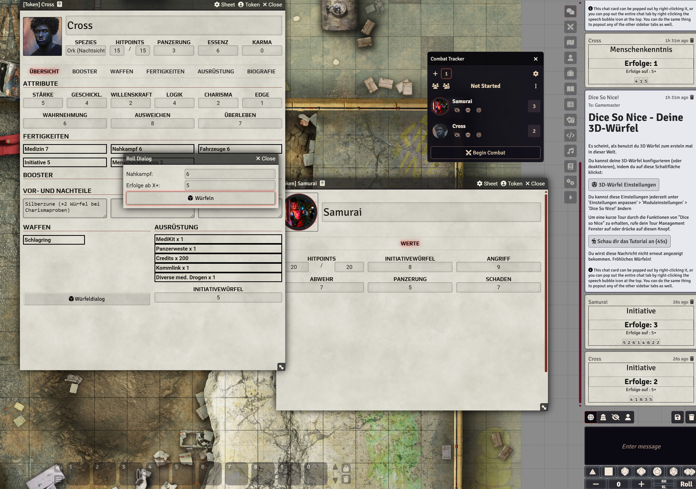

# Slumdogs System

Unofficial system implementation of Slumdogs:  https://sebahahn.itch.io/slumdogs

This system includes all items, spells and skills in german language from the rule set with friendly permission of the author Sebastian Hahn.

System author: Alexander "MrTheBino" Bierbrauer

Manual install foundry: https://github.com/MrTheBino/slumdogs-vtt/releases/latest/download/system.json

## supported languages

* German

The system is translatable via the JSON files in the lang/ directory.

